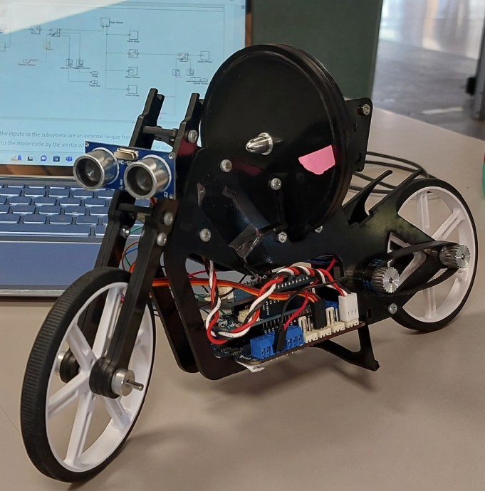
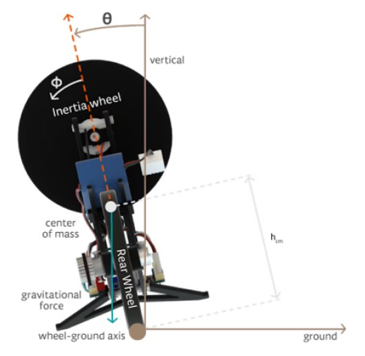
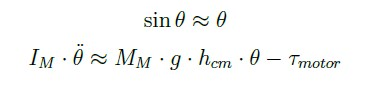

# Modelling_and_Control_Self-Balancing_Motorcycle
The main purpose of this project is controlling the self-balancing motorcycle provided by the Arduino Engineering Kit:
- Balancing the motorcycle **in place**.
- Balancing the motorcycle in **straight motion**
- Balancing the motorcycle in straight motion while **steering**.
  
In order to do it, different types of controllers will be designed:
- PID controller
- Feedback Linearization 
- Sliding Mode Control 

  
  
<em>Arduino Self-balancing Motorcycle</em>

The full report is available [here](./Control_Lab.pdf).

## Mathematical Model
In order to control the motorcycle, a model base design approach can be used. Hence, the equations of motion for the system needs to be retrieved with some semplification assumption.

  
  
<em>Motorcycle’s free body diagram</em>

  
